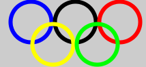

# OlympicRings

## Description
In this assignment you will write a program that displays the Olympic Rings. Your program will have about 13 lines of code and use the following functions, some more than once:

* ellipse( ... )
* size( ... )
* noFill()
* stroke( ... )
* strokeWeight( ... )

## Instructions
1. Write your code in Processing. Save your work!
1. When you're done, come back to github and fork this repo.
1. Update your forked version of `OlympicRings.pde`.
1. Update the header and footer text of `index.html`.
1. Check your work at `<YourUsername>.github.io/OlympicRings`
1. Create a pull request.

## Help
For help on github (and the crazy words above like 'fork' and 'repo'), see the class github starter kit.

For help on using the functions, see the unit slides or the Processing API.

For help on colors, use Paletton.

All these resources are linked from the course page.

## Credit
This assignment is based on a similar one created by [Art Simon](http://apcslowell.github.io).
